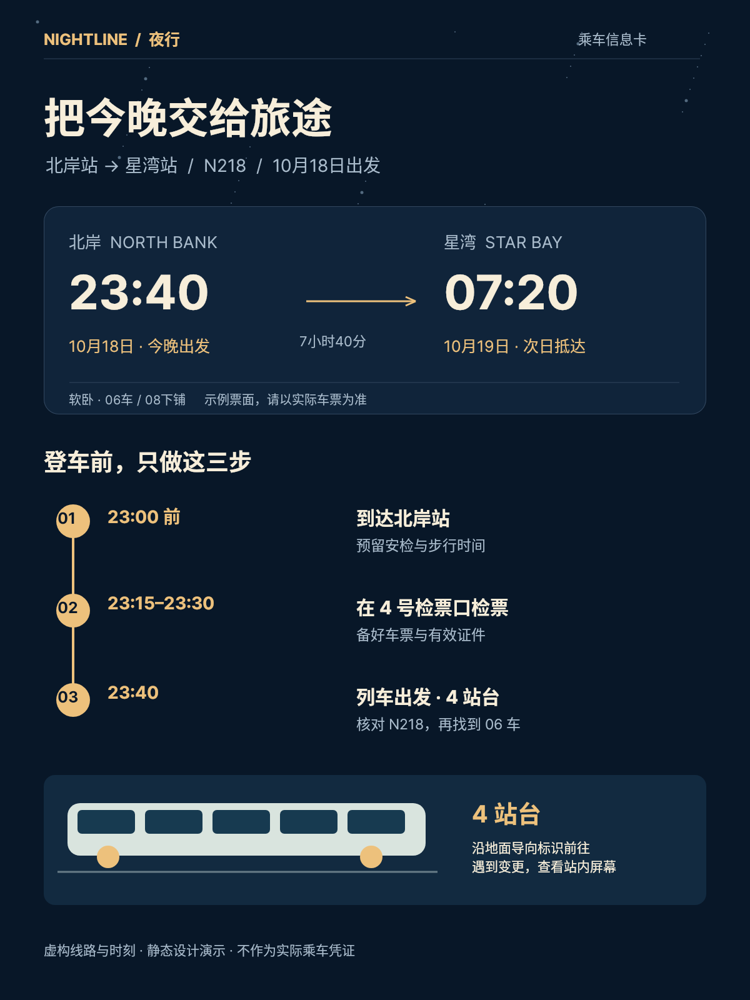
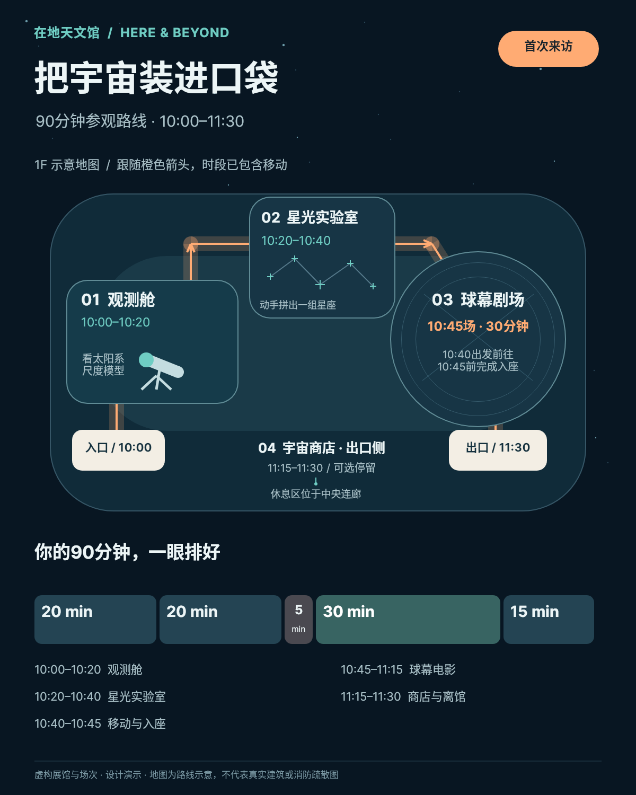
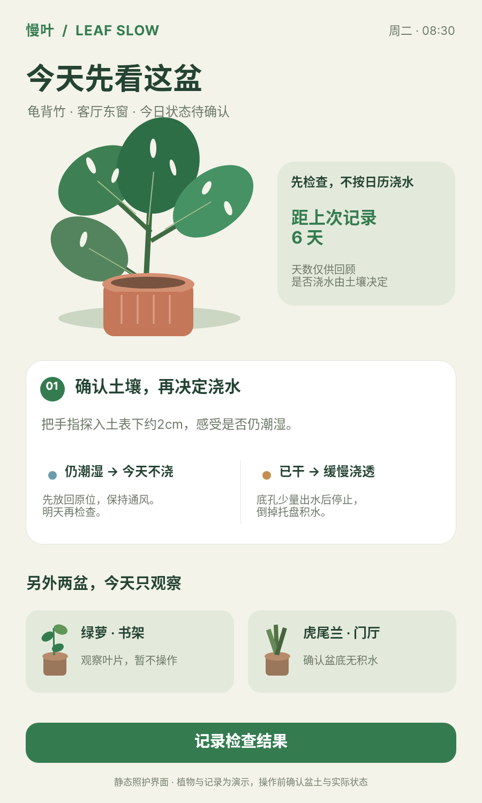
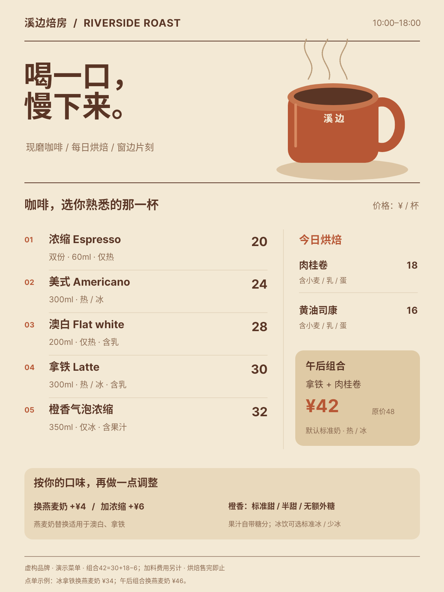
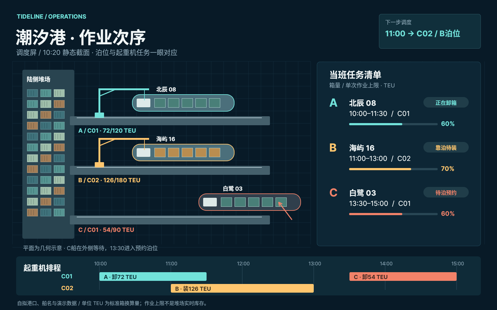
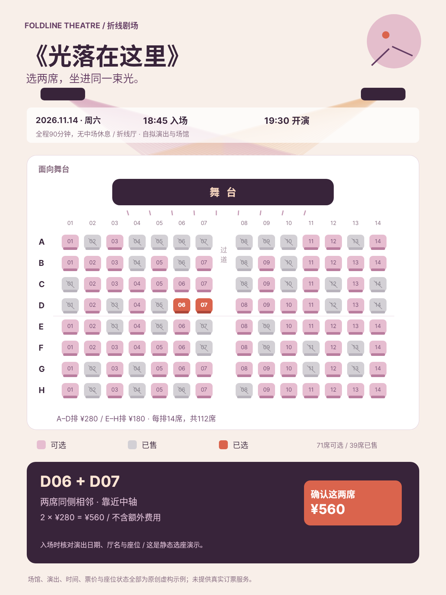
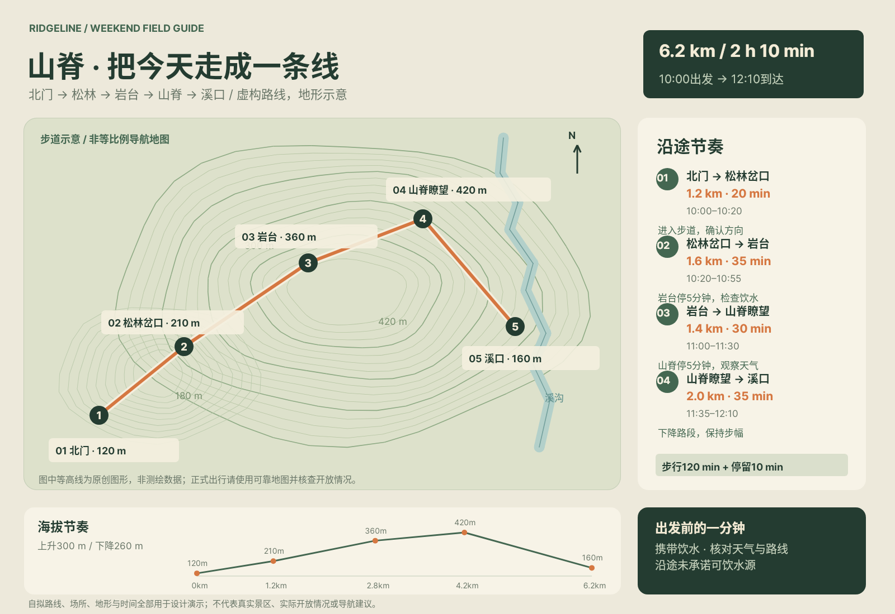
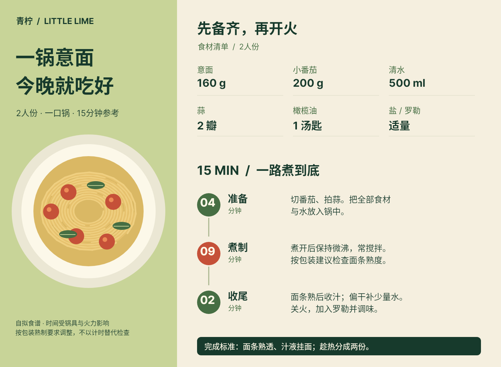
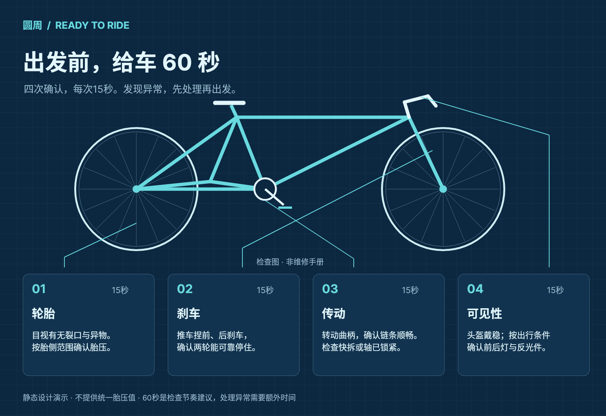
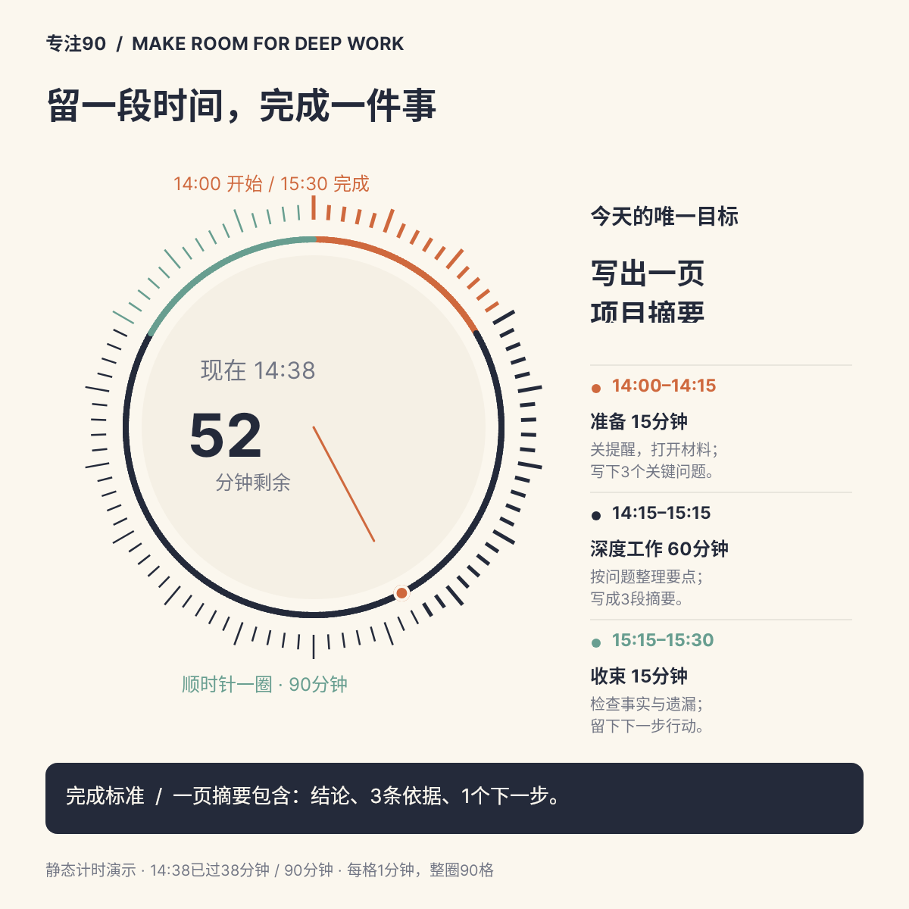

# B01 全作品索引

[完整本地画廊](gallery.html) · [作品集](portfolio.md) · [实际使用与验证](snapshot-usage.md)

## case-01 · 夜行 · 北岸站

[原尺寸PNG](case-01/final.png) · [完整Snapshot DSL](case-01/final.snapshot) · [独立用例说明](case-01/case.md)

确认跨日到达、检票截止、检票口、站台与车厢。
## case-02 · 在地天文馆 · 90分钟参观导览

[原尺寸PNG](case-02/final.png) · [完整Snapshot DSL](case-02/final.snapshot) · [独立用例说明](case-02/case.md)

在90分钟内按顺序参观两展厅并准时到球幕剧场入座后离馆。
## case-03 · 慢叶 · 今天先看这盆

[原尺寸PNG](case-03/final.png) · [完整Snapshot DSL](case-03/final.snapshot) · [独立用例说明](case-03/case.md)

先检查龟背竹土壤，再选择等待或浇水，随后记录结果。
## case-04 · 溪边焙房 · 完整点单菜单

[原尺寸PNG](case-04/final.png) · [完整Snapshot DSL](case-04/final.snapshot) · [独立用例说明](case-04/case.md)

选择咖啡、温度、适用换奶/加浓缩与甜度冰量，清楚知道单品和组合总价。
## case-05 · 潮汐港 · 作业次序

[原尺寸PNG](case-05/final.png) · [完整Snapshot DSL](case-05/final.snapshot) · [独立用例说明](case-05/case.md)

确认下一次起重机派工，并对照泊位、船舶、作业容量及资源排程。
## case-06 · 折线剧场 · 光落在这里

[原尺寸PNG](case-06/final.png) · [完整Snapshot DSL](case-06/final.snapshot) · [独立用例说明](case-06/case.md)

找到两席相邻可用座位并核对价格、舞台方向与入场时间。
## case-07 · 山脊 · 把今天走成一条线

[原尺寸PNG](case-07/final.png) · [完整Snapshot DSL](case-07/final.snapshot) · [独立用例说明](case-07/case.md)

理解路线先后、每段距离时间与停留点，准备饮水并判断完成时间。
## case-08 · 青柠 · 一锅意面

[原尺寸PNG](case-08/final.png) · [完整Snapshot DSL](case-08/final.snapshot) · [独立用例说明](case-08/case.md)

备齐2人食材并按4+9+2分钟参考流程完成意面。
## case-09 · 圆周 · 骑行前60秒

[原尺寸PNG](case-09/final.png) · [完整Snapshot DSL](case-09/final.snapshot) · [独立用例说明](case-09/case.md)

按轮胎、刹车、传动、可见性顺序完成出发前检查。
## case-10 · 专注90 · 一件事的时间

[原尺寸PNG](case-10/final.png) · [完整Snapshot DSL](case-10/final.snapshot) · [独立用例说明](case-10/case.md)

知道当前处于深度工作阶段，剩52分钟，并有明确交付标准。
