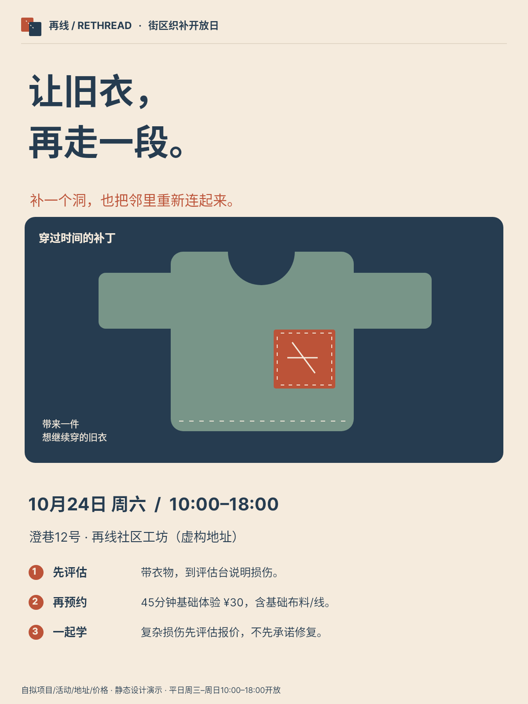
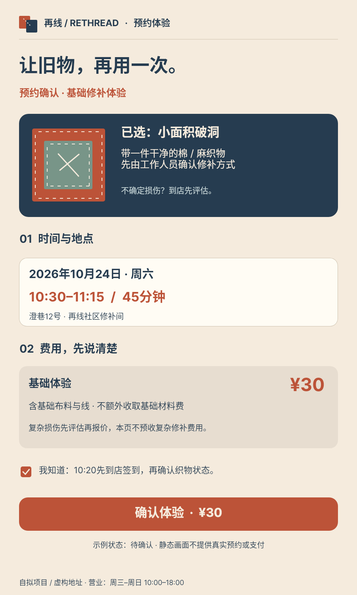
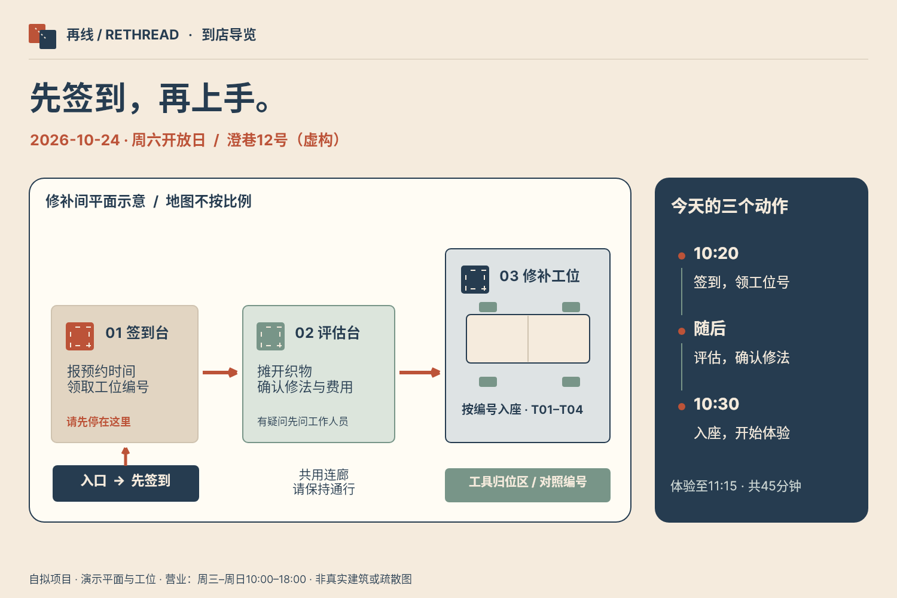
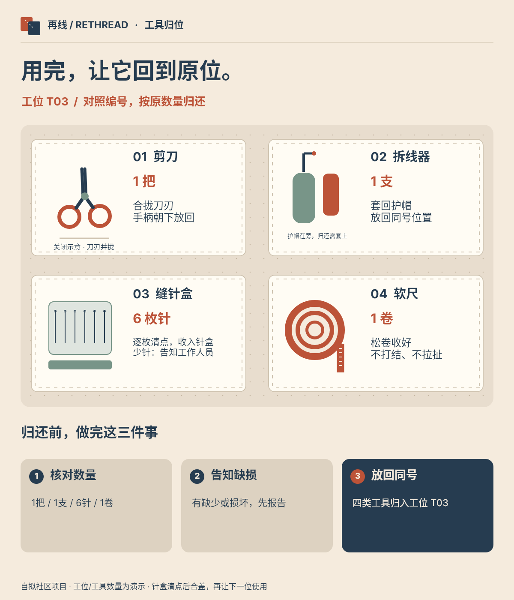
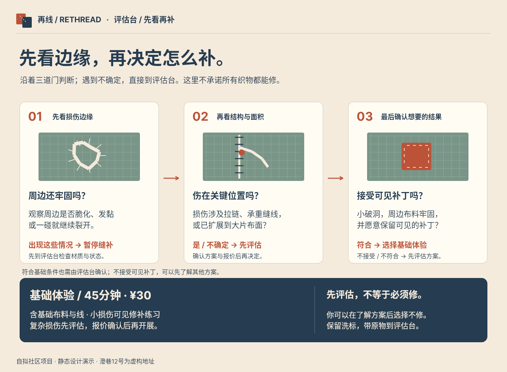
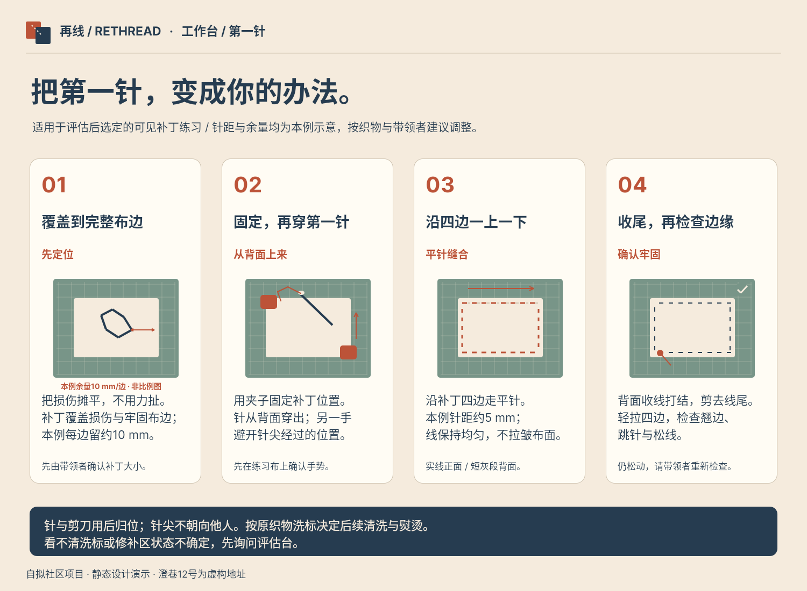
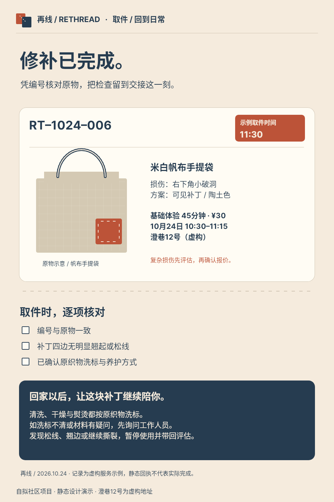
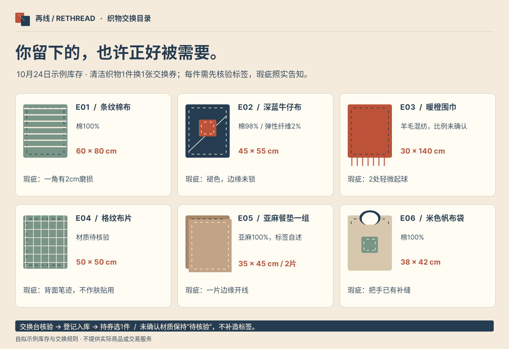
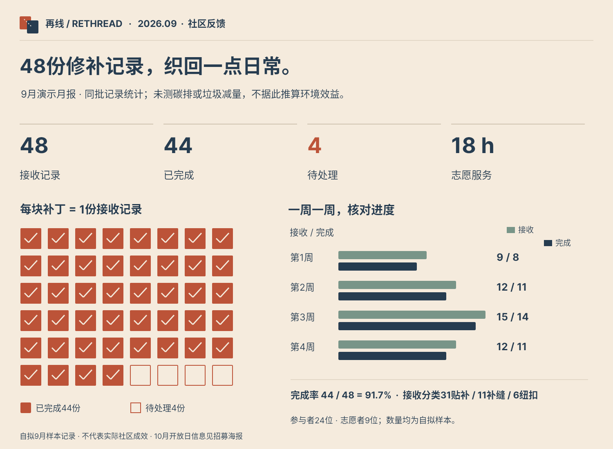
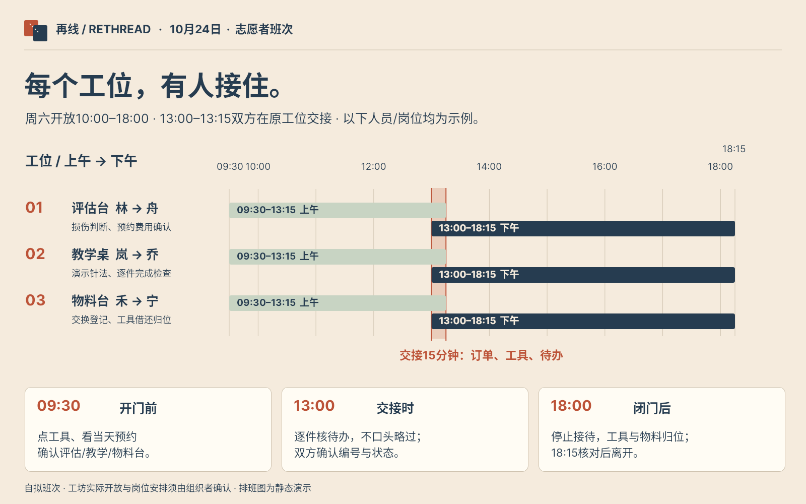

# B02 全作品索引

[完整本地画廊](gallery.html) · [作品集](portfolio.md) · [实际使用与验证](snapshot-usage.md)

## case-01 · 再线 · 街区织补开放日

[原尺寸PNG](case-01/final.png) · [完整Snapshot DSL](case-01/final.snapshot) · [独立用例说明](case-01/case.md)

理解项目、活动时间/地点、体验费用和先评估再预约的参与方式。
## case-02 · 预约确认界面

[原尺寸PNG](case-02/final.png) · [完整Snapshot DSL](case-02/final.snapshot) · [独立用例说明](case-02/case.md)

确认损伤类型、材料与费用、45分钟时段和提前10分钟签到后决定参与。
## case-03 · 到店签到与空间导览

[原尺寸PNG](case-03/final.png) · [完整Snapshot DSL](case-03/final.snapshot) · [独立用例说明](case-03/case.md)

先在签到台报预约领取工位号，再找到评估台确认修法，10:30进入修补工位。
## case-04 · 工作台工具归位板

[原尺寸PNG](case-04/final.png) · [完整Snapshot DSL](case-04/final.snapshot) · [独立用例说明](case-04/case.md)

清点四种工具，识别缺损，按编号放回原位置，避免下一位借用缺件。
## case-05 · 三道门 · 织物损伤评估

[原尺寸PNG](case-05/final.png) · [完整Snapshot DSL](case-05/final.snapshot) · [独立用例说明](case-05/case.md)

判断基础体验或先评估，理解费用边界。
## case-06 · 四步 · 可见补丁学习卡

[原尺寸PNG](case-06/final.png) · [完整Snapshot DSL](case-06/final.snapshot) · [独立用例说明](case-06/case.md)

按顺序定位/固定/缝合/收尾并检查，不依赖空白组件。
## case-07 · 交接回执 · 把补丁带回日常

[原尺寸PNG](case-07/final.png) · [完整Snapshot DSL](case-07/final.snapshot) · [独立用例说明](case-07/case.md)

凭编号核对原物、时间费用与质量检查，并按洗标养护。
## case-08 · 再线 · 织物交换目录

[原尺寸PNG](case-08/final.png) · [完整Snapshot DSL](case-08/final.snapshot) · [独立用例说明](case-08/case.md)

比较六件织物的材质、尺寸与瑕疵，持券选一件并在交换台核验。
## case-09 · 再线 · 9月社区反馈

[原尺寸PNG](case-09/final.png) · [完整Snapshot DSL](case-09/final.snapshot) · [独立用例说明](case-09/case.md)

核对同批接收/完成/待处理记录与志愿时间，看到演示进度而不误信环保推算。
## case-10 · 再线 · 志愿者班次作战板

[原尺寸PNG](case-10/final.png) · [完整Snapshot DSL](case-10/final.snapshot) · [独立用例说明](case-10/case.md)

找到岗位和班次，按15分钟双人在岗交接，完成开门/交接/闭门核对。
