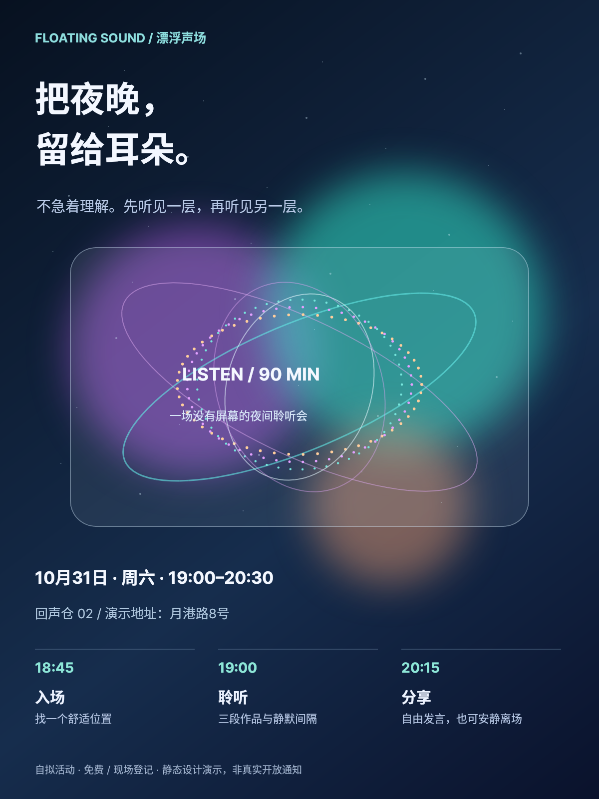
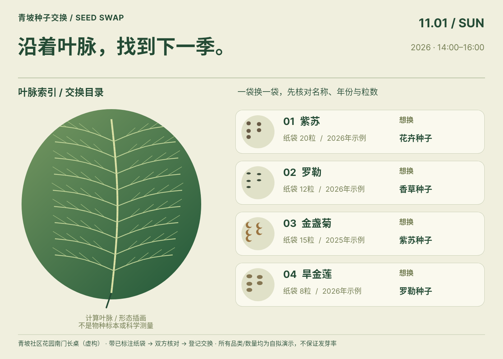
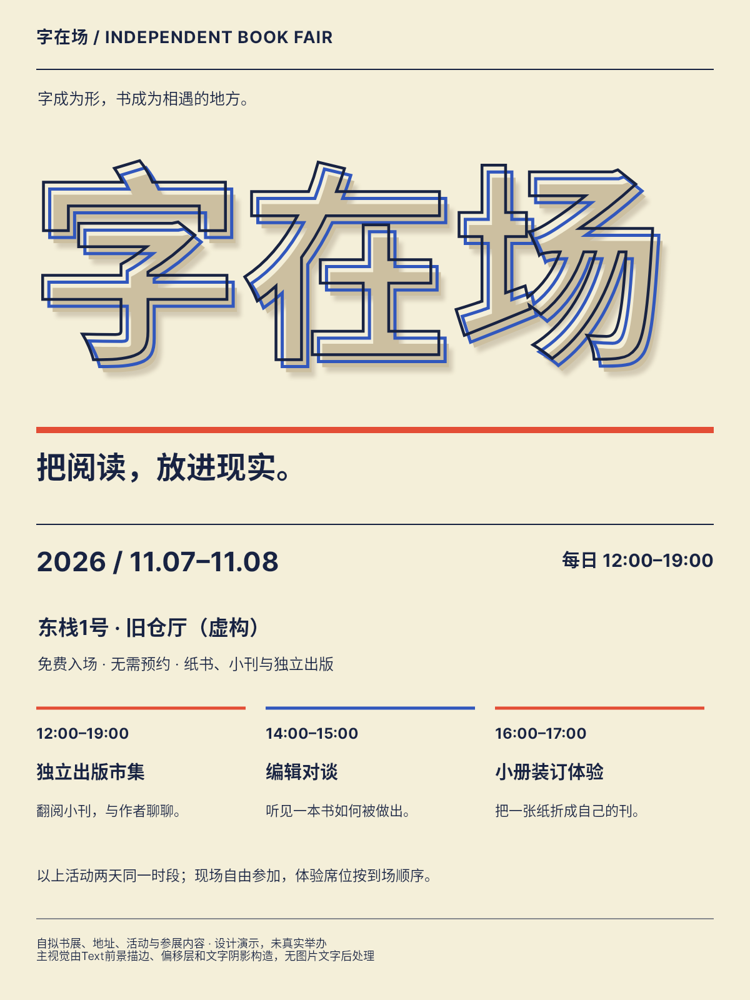
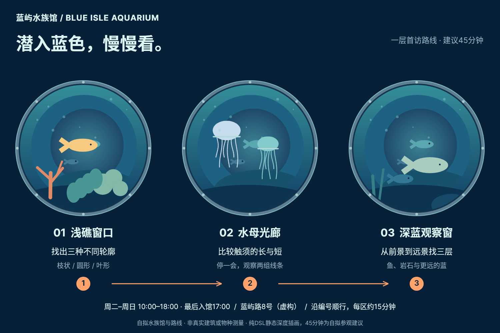
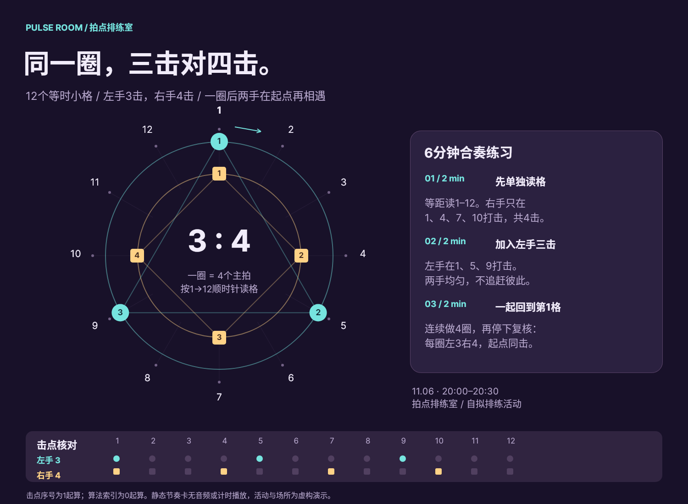
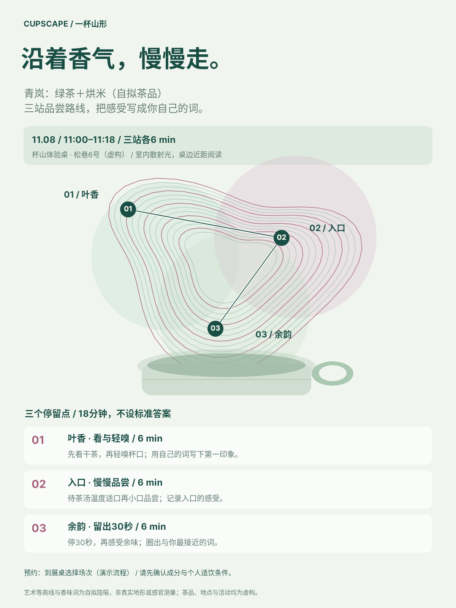
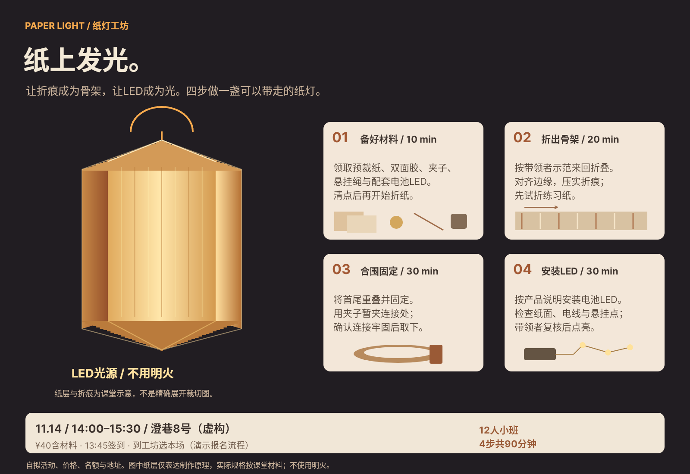
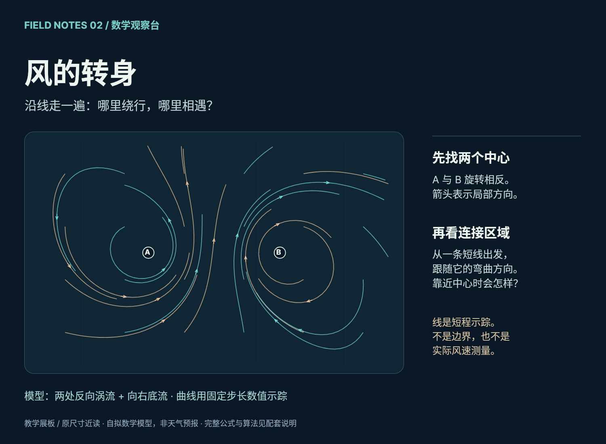
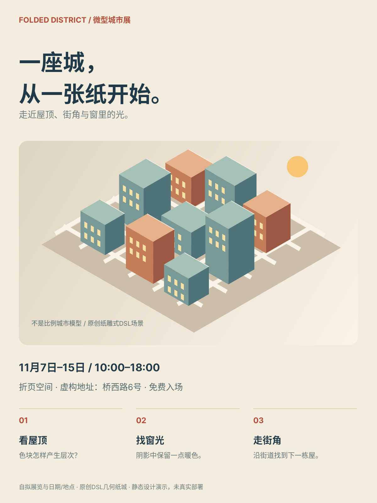
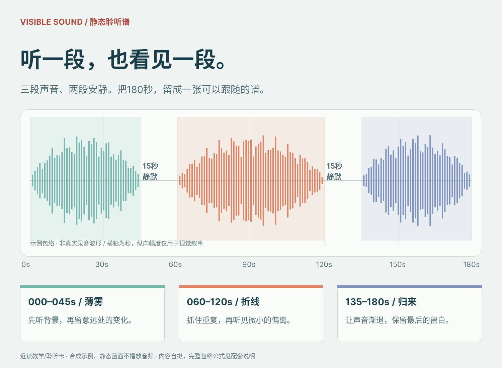

# B03 全作品索引

[完整本地画廊](gallery.html) · [作品集](portfolio.md) · [实际使用与验证](snapshot-usage.md)

## case-01 · 漂浮声场 · 夜间聆听会

[原尺寸PNG](case-01/final.png) · [完整Snapshot DSL](case-01/final.snapshot) · [独立用例说明](case-01/case.md)

理解90分钟聆听活动并核对日期/地点/入场与分享安排。
## case-02 · 种子交换 · 叶脉索引

[原尺寸PNG](case-02/final.png) · [完整Snapshot DSL](case-02/final.snapshot) · [独立用例说明](case-02/case.md)

比较四袋名称、粒数、年份与想换品类，带标注纸袋到指定时地完成双方核对和交换。
## case-03 · 字在场 · 独立书展

[原尺寸PNG](case-03/final.png) · [完整Snapshot DSL](case-03/final.snapshot) · [独立用例说明](case-03/case.md)

识别展期地点、免费参与条件及每日三个活动时段后决定到访。
## case-04 · 潜入蓝色 · 水族馆导览

[原尺寸PNG](case-04/final.png) · [完整Snapshot DSL](case-04/final.snapshot) · [独立用例说明](case-04/case.md)

沿01浅礁、02水母光廊、03深蓝窗依次观看，并通过轮廓/触须/前后层完成三项观察任务。
## case-05 · 三对四 · 合奏排练卡

[原尺寸PNG](case-05/final.png) · [完整Snapshot DSL](case-05/final.snapshot) · [独立用例说明](case-05/case.md)

按等距小格打出左3右4，并核对每圈同时回到起点。
## case-06 · 一杯山形 · 三站茶香体验路线

[原尺寸PNG](case-06/final.png) · [完整Snapshot DSL](case-06/final.snapshot) · [独立用例说明](case-06/case.md)

在18分钟内完成叶香、入口、余味观察并写下主观词汇。
## case-07 · 纸上发光 · 灯笼制作课

[原尺寸PNG](case-07/final.png) · [完整Snapshot DSL](case-07/final.snapshot) · [独立用例说明](case-07/case.md)

准备材料并按四步制作LED纸灯，理解时间/报名和检查条件。
## case-08 · 风的转身 · 双涡流观察

[原尺寸PNG](case-08/final.png) · [完整Snapshot DSL](case-08/final.snapshot) · [独立用例说明](case-08/case.md)

识别两处反向涡流、观察局部方向与连接区域，区分模型和真实测量。
## case-09 · 折叠街区 · 微型城市展

[原尺寸PNG](case-09/final.png) · [完整Snapshot DSL](case-09/final.snapshot) · [独立用例说明](case-09/case.md)

了解纸艺展览开放与入场，并按屋顶/窗光/街角三任务看展。
## case-10 · 看见声音 · 三段聆听谱

[原尺寸PNG](case-10/final.png) · [完整Snapshot DSL](case-10/final.snapshot) · [独立用例说明](case-10/case.md)

按180秒时间谱体验三段及两次15秒静默，并区分包络示例和实际录音。
