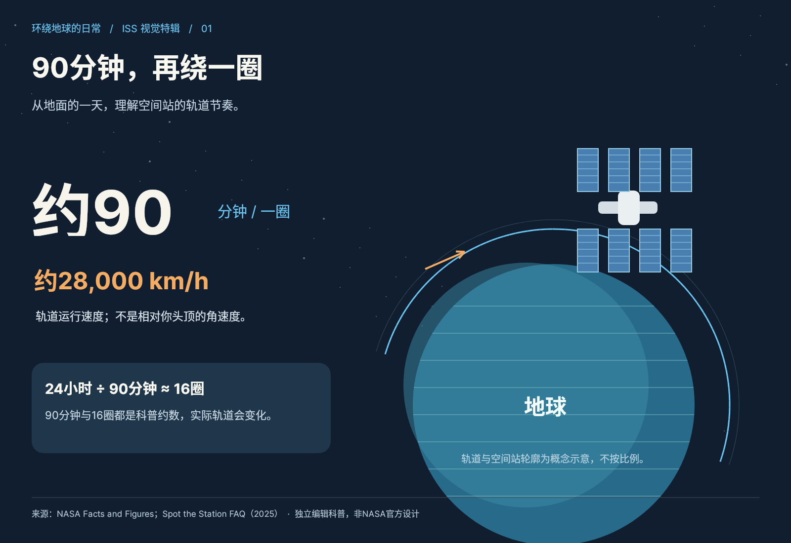
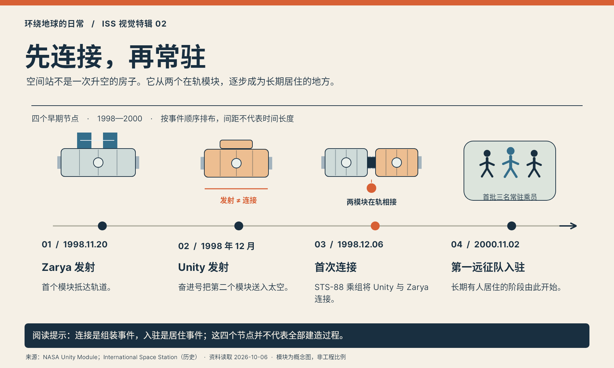
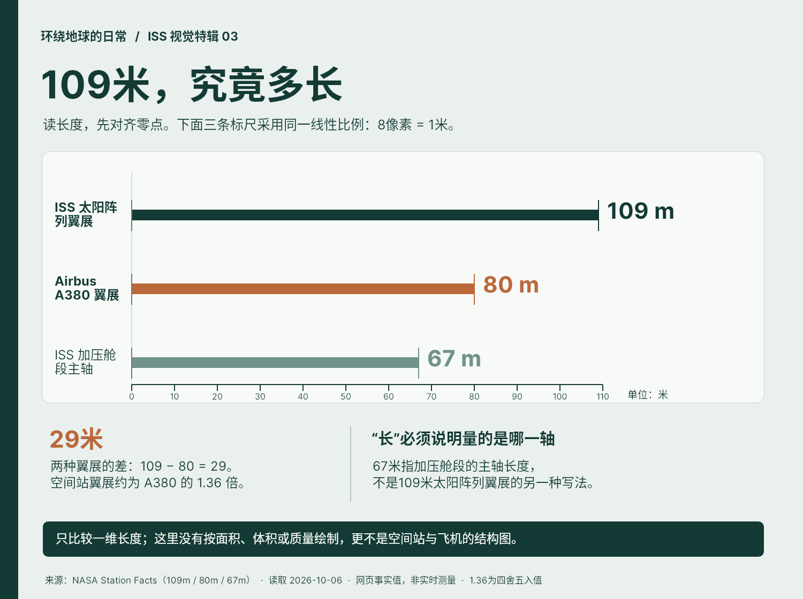
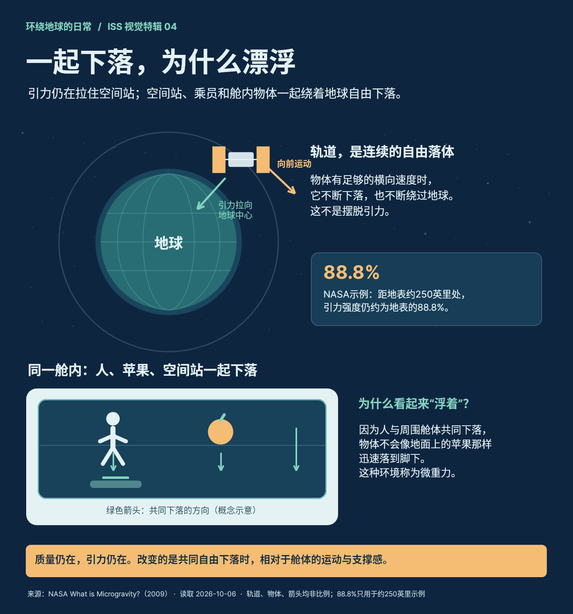
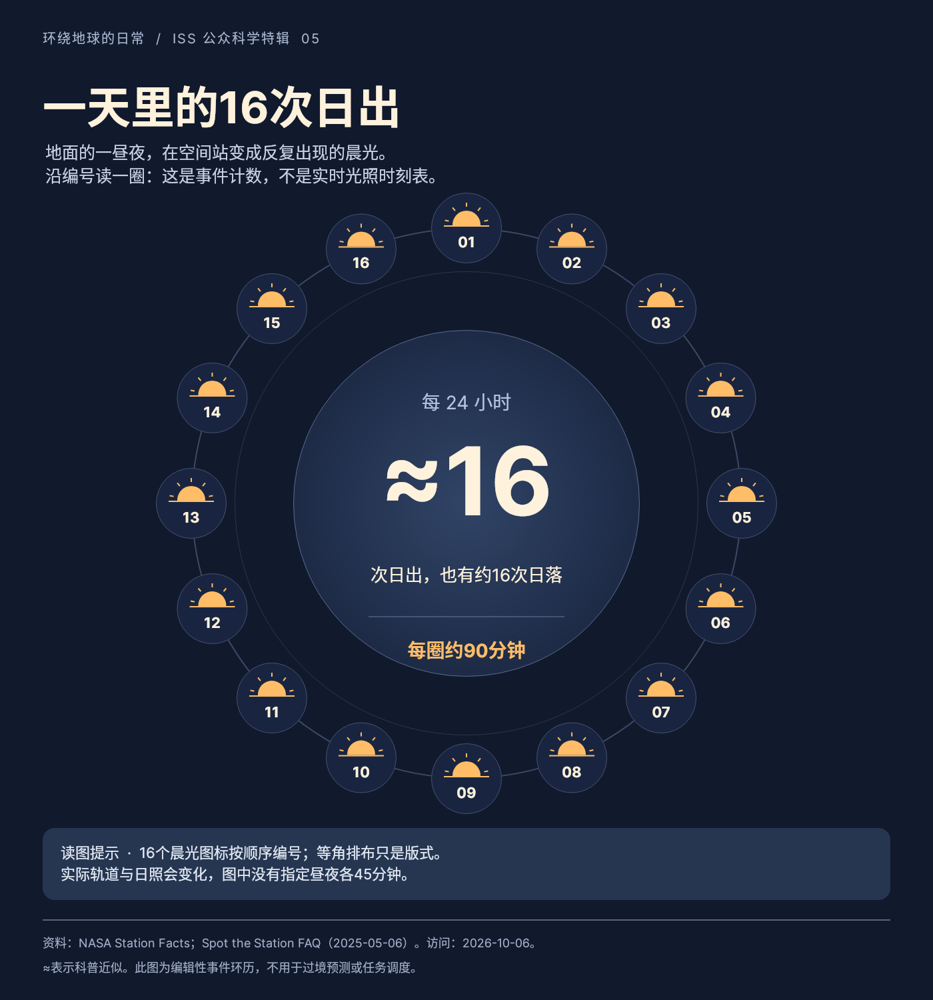
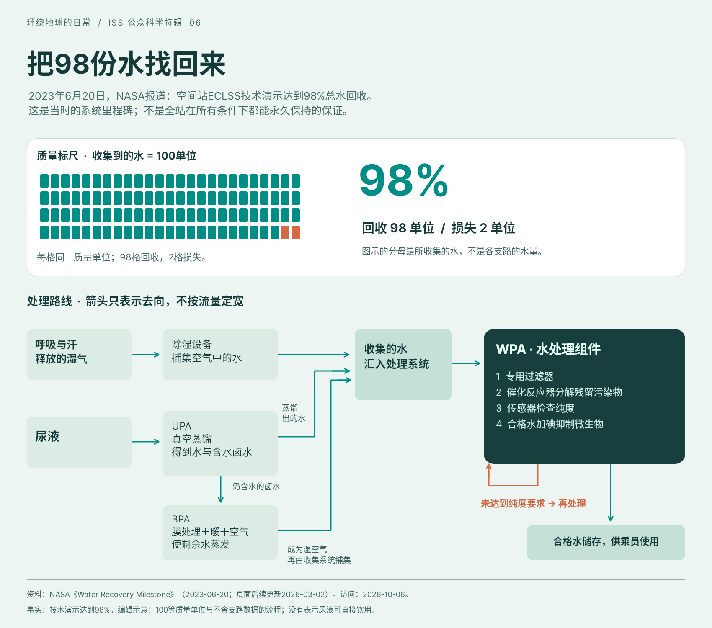
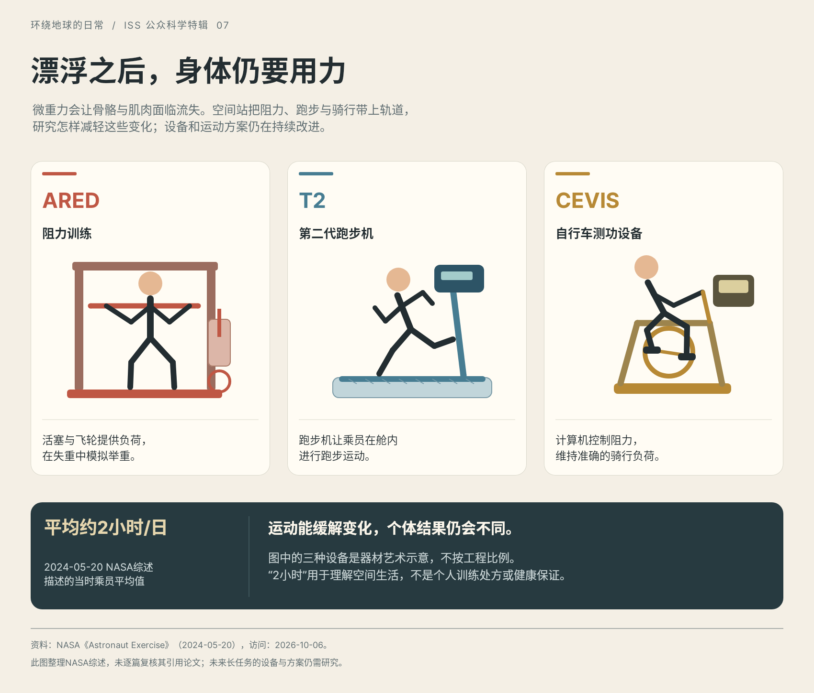
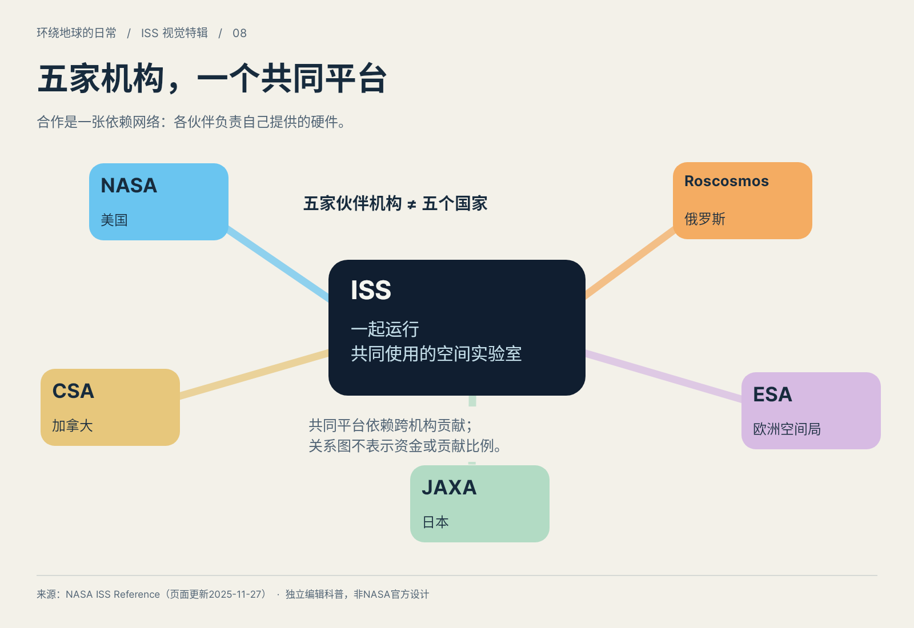
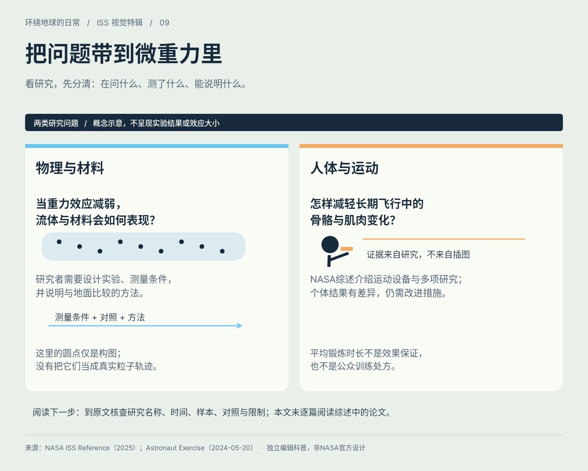
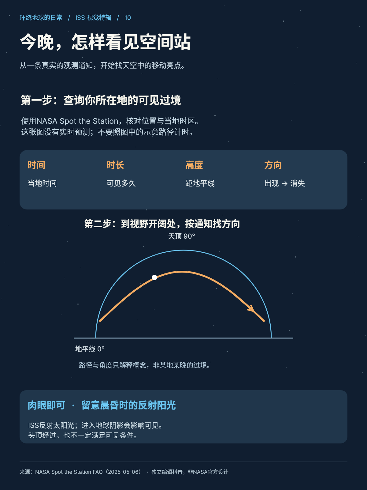

# B04 全作品索引

[完整本地画廊](gallery.html) · [作品集](portfolio.md) · [实际使用与验证](snapshot-usage.md)

## case-01 · 90分钟，再绕一圈

[原尺寸PNG](case-01/final.png) · [完整Snapshot DSL](case-01/final.snapshot) · [独立用例说明](case-01/case.md)

连接90分钟、一小时速度与一天约16圈的含义。
## case-02 · 先连接，再常驻

[原尺寸PNG](case-02/final.png) · [完整Snapshot DSL](case-02/final.snapshot) · [独立用例说明](case-02/case.md)

分清首模块发射、第二模块发射、首次连接与首批常驻入驻四件不同事情。
## case-03 · 109米，究竟多长

[原尺寸PNG](case-03/final.png) · [完整Snapshot DSL](case-03/final.snapshot) · [独立用例说明](case-03/case.md)

使用一致零点和同一线性尺度比较ISS翼展、A380翼展，区分翼展和加压舱段主轴。
## case-04 · 一起下落，为什么漂浮

[原尺寸PNG](case-04/final.png) · [完整Snapshot DSL](case-04/final.snapshot) · [独立用例说明](case-04/case.md)

解释为什么轨道中的漂浮不是没有引力，而是空间站、乘员与物体共同自由下落。
## case-05 · 一天里的16次日出

[原尺寸PNG](case-05/final.png) · [完整Snapshot DSL](case-05/final.snapshot) · [独立用例说明](case-05/case.md)

数出16次晨光，理解24小时与约90分钟一圈的关系，同时辨认示意与实时数据的区别。
## case-06 · 把98份水找回来

[原尺寸PNG](case-06/final.png) · [完整Snapshot DSL](case-06/final.snapshot) · [独立用例说明](case-06/case.md)

准确说明98%的分母和2023演示时点，追踪水如何经历收集、蒸馏、回收、过滤与纯度检验。
## case-07 · 漂浮之后，身体仍要用力

[原尺寸PNG](case-07/final.png) · [完整Snapshot DSL](case-07/final.snapshot) · [独立用例说明](case-07/case.md)

辨认ARED、T2、CEVIS及其作用，理解平均2小时/日是2024综述的历史描述，个体结果有差异。
## case-08 · 五家机构，一个共同平台

[原尺寸PNG](case-08/final.png) · [完整Snapshot DSL](case-08/final.snapshot) · [独立用例说明](case-08/case.md)

识别五家伙伴机构并理解互相依赖的运作。
## case-09 · 把问题带到微重力里

[原尺寸PNG](case-09/final.png) · [完整Snapshot DSL](case-09/final.snapshot) · [独立用例说明](case-09/case.md)

把研究问题、来源综述与概念示意分开，知道下一步如何查证。
## case-10 · 今晚，怎样看见空间站

[原尺寸PNG](case-10/final.png) · [完整Snapshot DSL](case-10/final.snapshot) · [独立用例说明](case-10/case.md)

查当地真实通知，读懂时间、方向、高度，选择开阔处观看。
