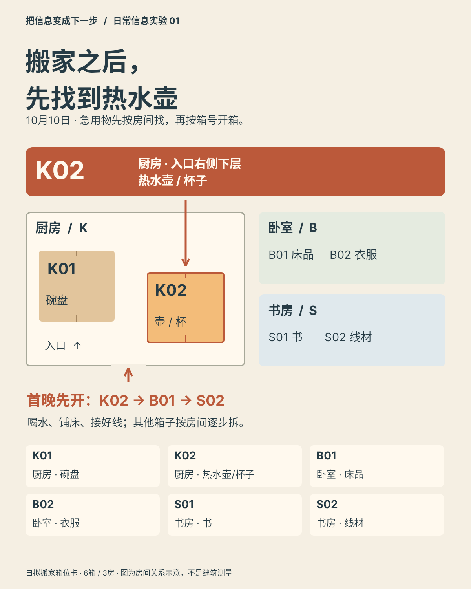
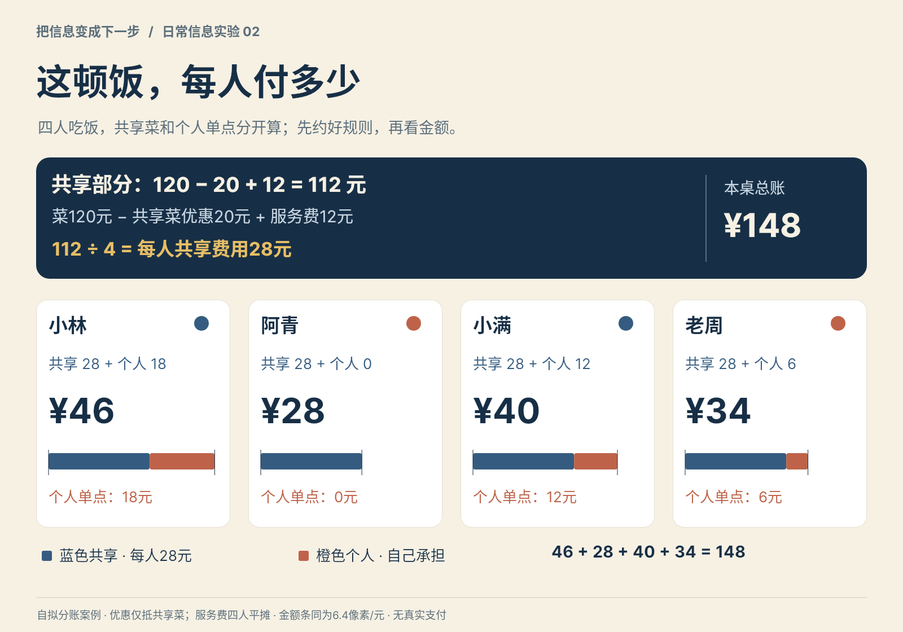
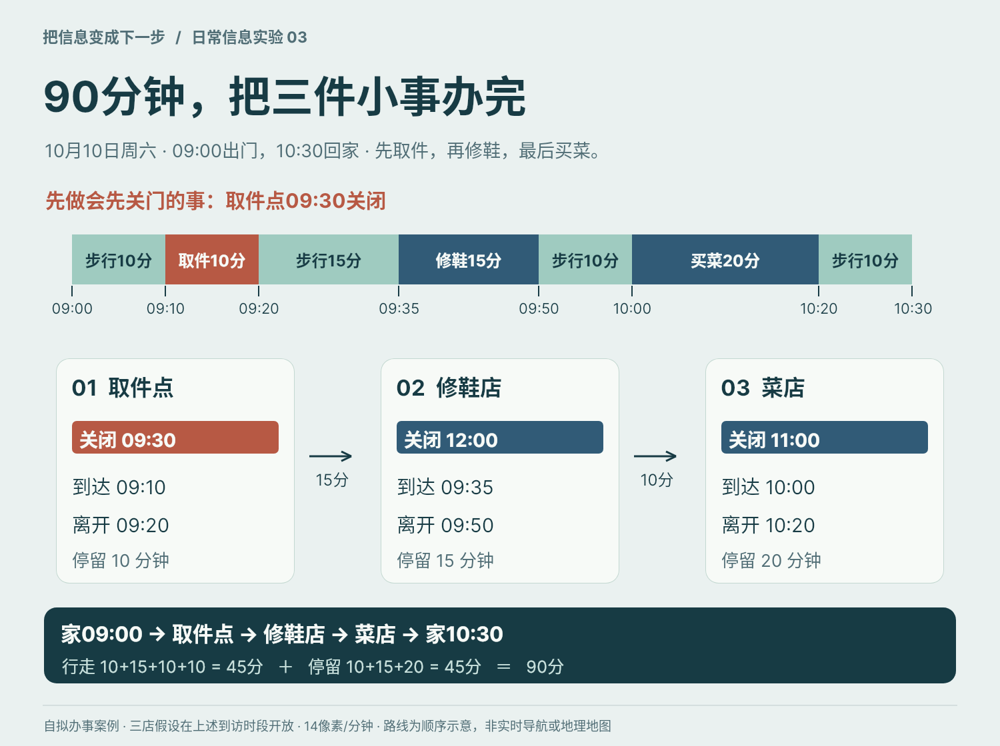
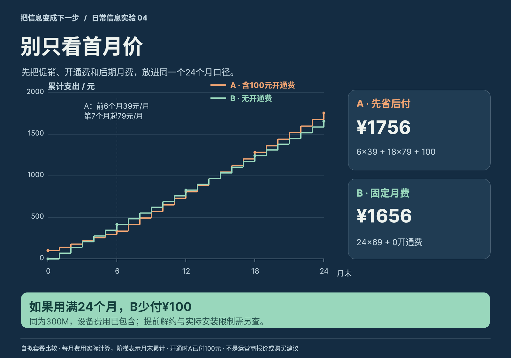
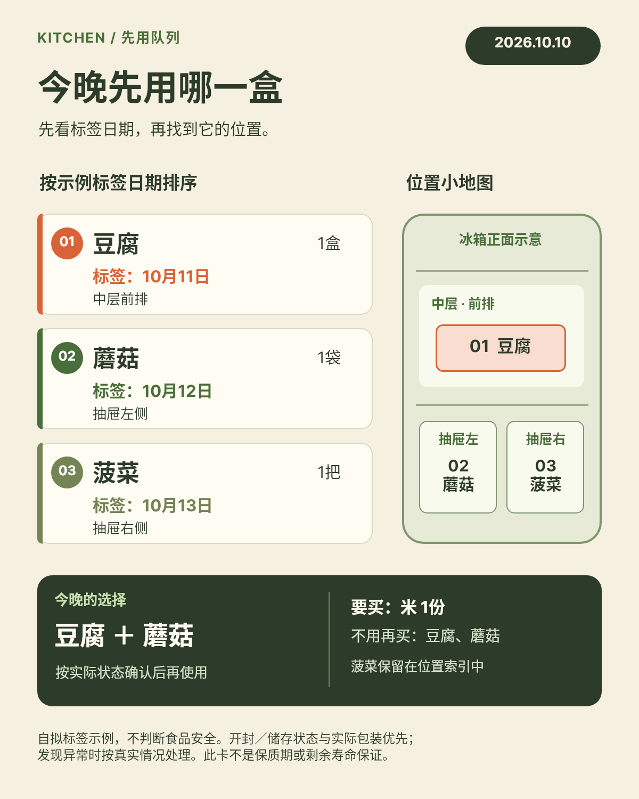
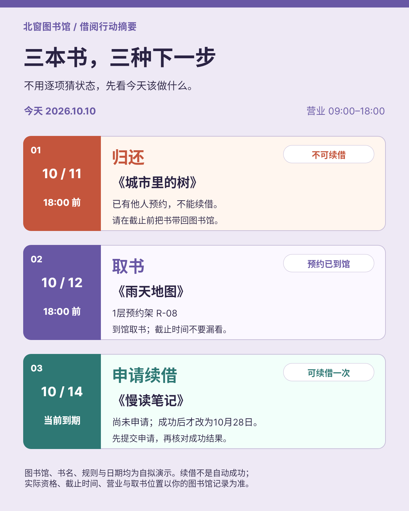
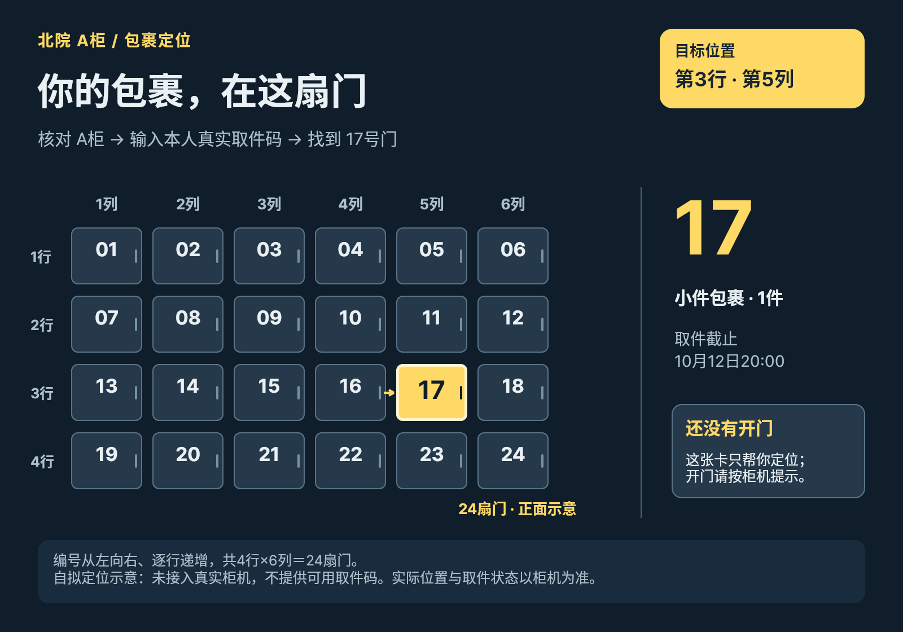
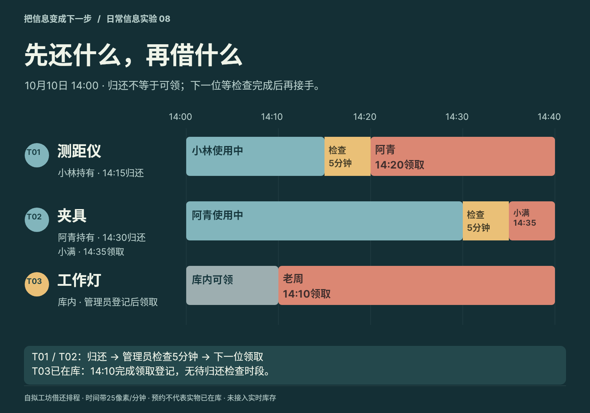
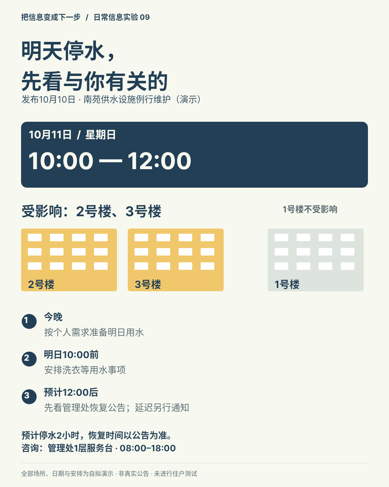
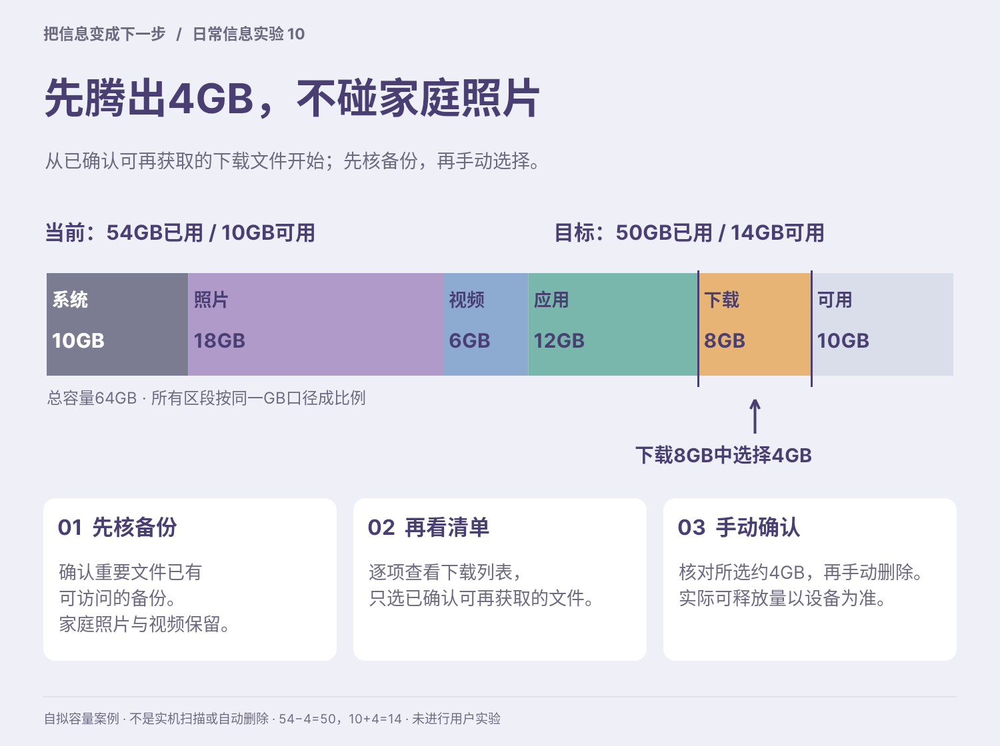

# B06 全作品索引

[本地完整画廊](gallery.html) · [作品集](portfolio.md) · [实际使用说明](snapshot-usage.md)

## case-01 · 搬家之后，先找到热水壶

[原始完整PNG](case-01/final.png) · [完整Snapshot DSL](case-01/final.snapshot) · [场景与实际审查](case-01/case.md)

定位热水壶在厨房K02入口右侧下层，按首晚优先顺序拆箱。
## case-02 · 这顿饭，每人付多少

[原始完整PNG](case-02/final.png) · [完整Snapshot DSL](case-02/final.snapshot) · [场景与实际审查](case-02/case.md)

按共享优惠和服务费规则，准确知道四人各应付46/28/40/34元并核合计148元。
## case-03 · 90分钟，把三件小事办完

[原始完整PNG](case-03/final.png) · [完整Snapshot DSL](case-03/final.snapshot) · [场景与实际审查](case-03/case.md)

从09:00开始按取件/修鞋/买菜先后办事，避开取件点09:30关门并于10:30返回家。
## case-04 · 别只看首月价

[原始完整PNG](case-04/final.png) · [完整Snapshot DSL](case-04/final.snapshot) · [场景与实际审查](case-04/case.md)

统一24个月口径核开通费与两阶段月费，在条件相同且用满周期时知道B比A少100元。
## case-05 · 今晚先用哪一盒

[原始完整PNG](case-05/final.png) · [完整Snapshot DSL](case-05/final.snapshot) · [场景与实际审查](case-05/case.md)

从演示日期队列找到豆腐与蘑菇，确定今晚要用及无需重复购买的项目。
## case-06 · 三本书，三种下一步

[原始完整PNG](case-06/final.png) · [完整Snapshot DSL](case-06/final.snapshot) · [场景与实际审查](case-06/case.md)

先归还不可续借的书、到馆取预约书，并把第三本的续借申请与结果区别开。
## case-07 · 你的包裹，在这扇门

[原始完整PNG](case-07/final.png) · [完整Snapshot DSL](case-07/final.snapshot) · [场景与实际审查](case-07/case.md)

在24门的A柜中可靠定位第3行第5列17号门，并理解尚未开门、仍须本人真实取件码。
## case-08 · 先还什么，再借什么

[原始完整PNG](case-08/final.png) · [完整Snapshot DSL](case-08/final.snapshot) · [场景与实际审查](case-08/case.md)

看清三件工具的持有人、归还/检查/可领时间，按各自下一动作交接。
## case-09 · 明天停水，先看与你有关的

[原始完整PNG](case-09/final.png) · [完整Snapshot DSL](case-09/final.snapshot) · [场景与实际审查](case-09/case.md)

判断自己楼栋是否受影响，核10月11日两小时时窗并知道恢复需看公告。
## case-10 · 先腾出4GB，不碰家庭照片

[原始完整PNG](case-10/final.png) · [完整Snapshot DSL](case-10/final.snapshot) · [场景与实际审查](case-10/case.md)

读64GB组成，在确认备份后从下载区选择可再获取的4GB，理解可用量10到14变化。
