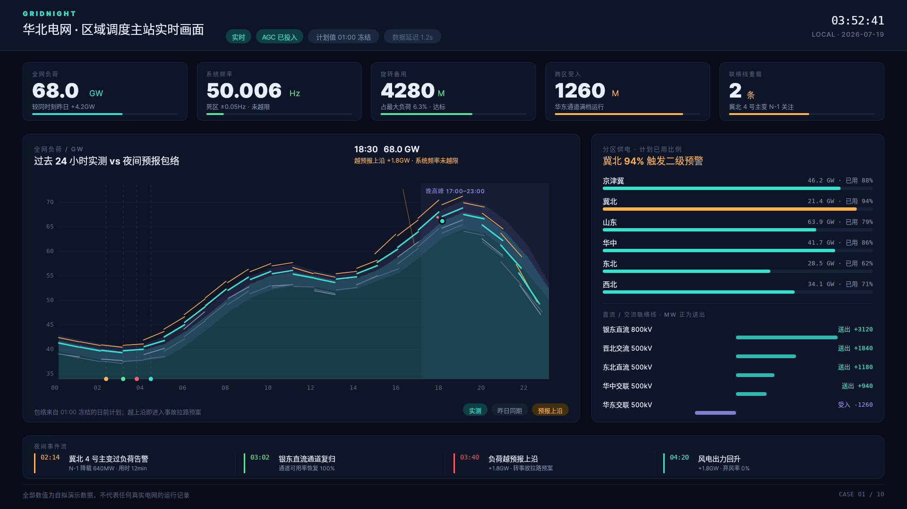
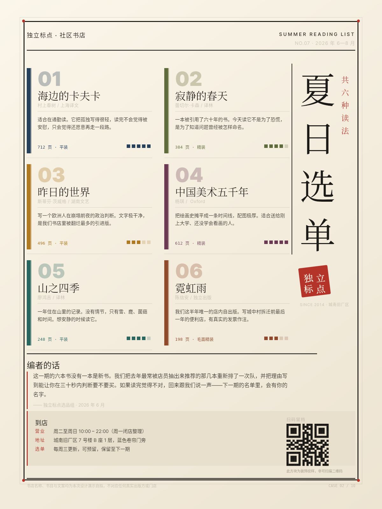
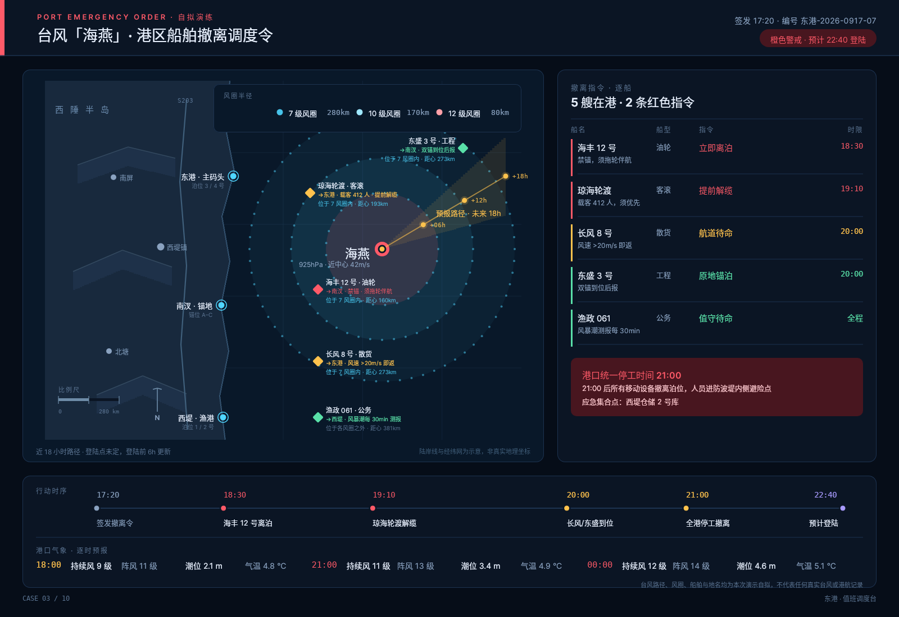
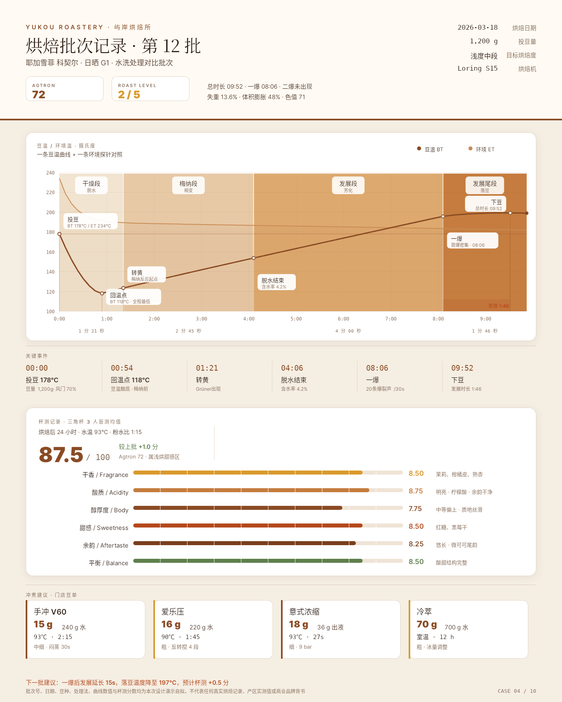
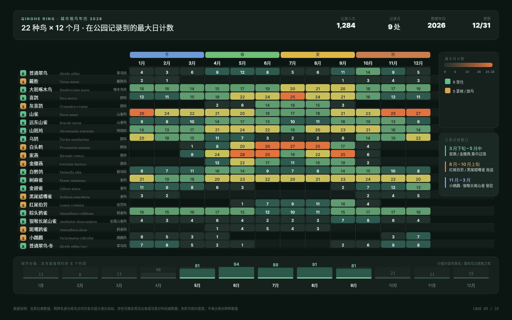
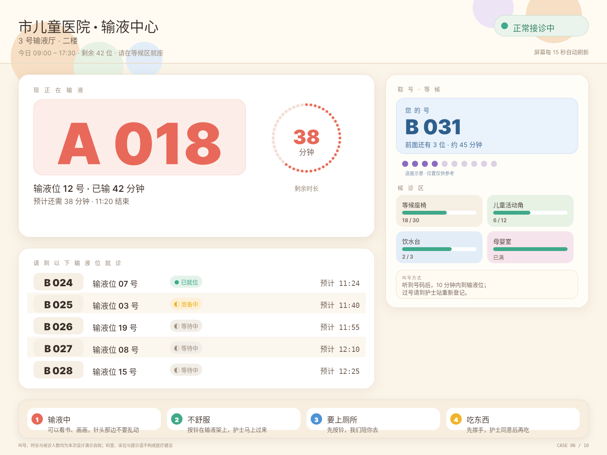
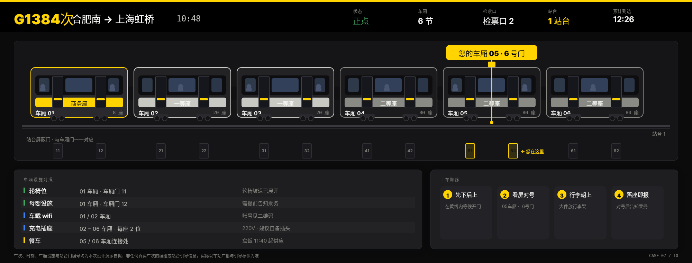
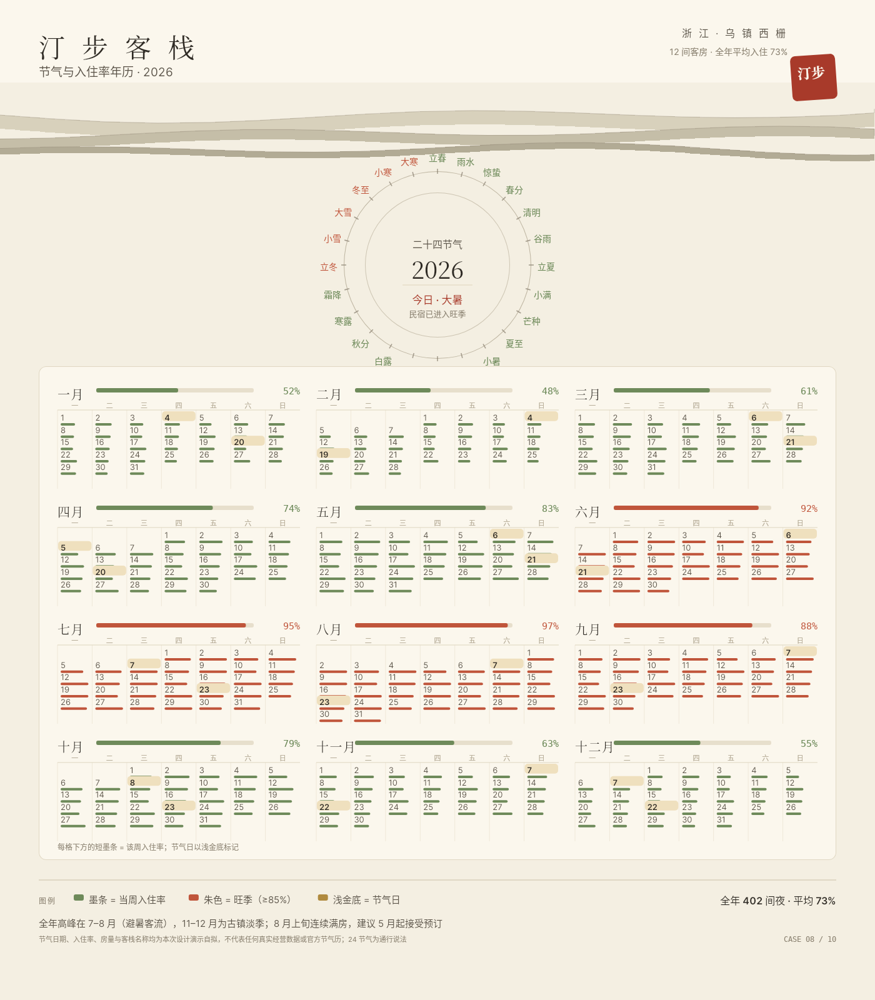
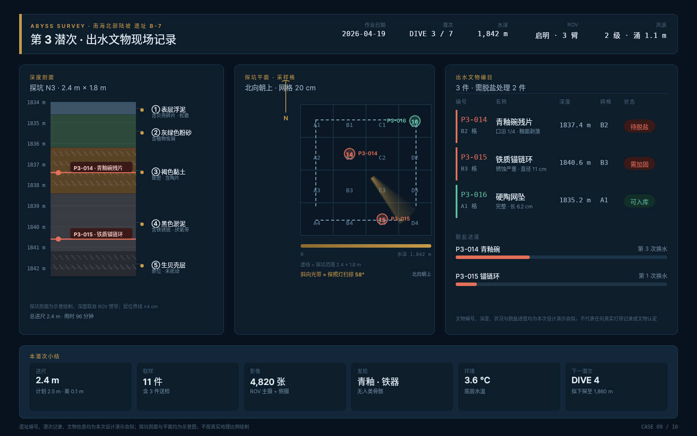
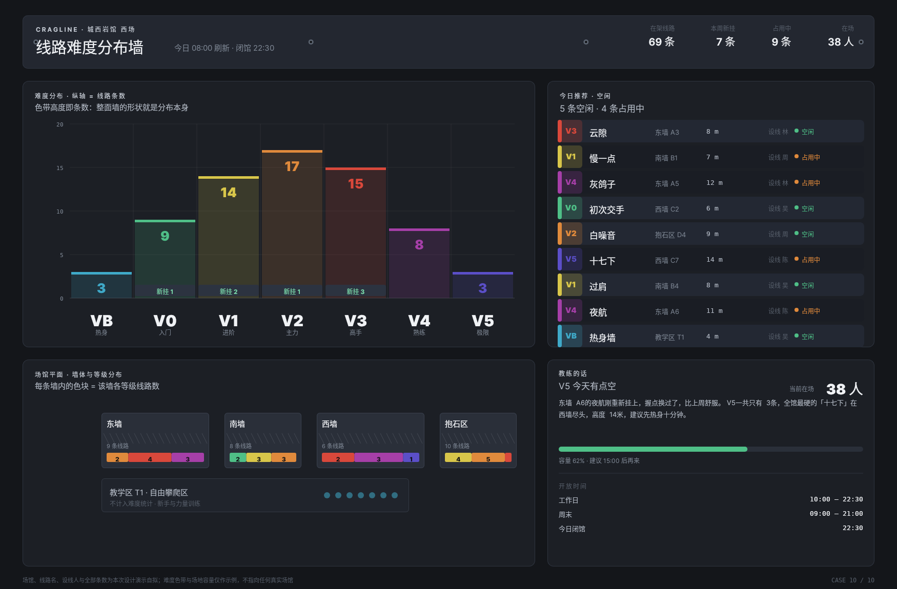

# B01 · 十张真实场景的炫酷用例 · 策展

> 十件独立完整用例。全部主体、排版、图形与图表由完整 DSL 构造，经
> `POST https://open-snapshot.muedsa.com/snapshot` 真实渲染；PNG 是服务响应的原始字节，
> 未做任何后处理补字或修图。**十件全部未使用 `<Image>`、未引入任何外部图片素材。**
> 每件的品牌名、编号、日期、统计值与文案均为本次设计演示自拟，用于展示这套 DSL 能承载什么，
> **不宣称是任何实际部署的客户作品**，也不指向任何真实机构。

## 策展逻辑

这十件不是十个题材，而是十种「看」的方式：从余光可读的调度台，到必须三十秒内决策的纸面海报；从需要表达移动风场的同心圆扫描线，到把图表本身当作刻度盘。它们共享同一套排版节奏与圆角语言（atelier.py 的令牌），但配色系统、构图骨架、表现手法与画幅比例全部互不相同。至少一件（case-02）完全没有图表，一件（case-10）把直方图和难度轴合并成同一个动作，一件（case-07）用空间对齐代替文字说明，一件（case-06）把装饰当作功能使用——这四件是这个作品集真正的观点。

这十件不是十个题材，而是十种「看」的方式。它们共享同一套排版节奏与圆角语言
（`tmp/20261004-182918/B01/atelier.py` 里的令牌），但配色系统、构图骨架、表现手法与
画幅比例全部互不相同：画幅从 1200×1600 到 2000×760，从竖版纸卡到超宽站台屏；
密度从 case-02 的零图表到 case-05 的 264 格年历。

按视觉手法分类，十件覆盖了这些互不重复的方向：

| 手法 | 用例 | 说明 |
|---|---|---|
| 零图表纯排版 | case-02 | 只靠字号层级与色条完成说服 |
| 双轴面积图 + 包络带 | case-01 | 逐列贴边填充保证曲线光滑 |
| 同心圆扫描线场 | case-03 | 疏密差编码风力等级 |
| 单图双曲线 + 阶段色带 | case-04 | 色深编码反应深度 |
| 高密度日历网格 | case-05 | 两套色系分层管理「何时/多少」 |
| 儿童友好大字号 + 几何插画 | case-06 | 装饰即功能 |
| 侧视图 + 空间对齐 | case-07 | 用几何替代文字说明 |
| 圆环刻度盘 + 双时间尺度 | case-08 | 钟面与年历并置 |
| 按比例地层柱 + 编目表 | case-09 | 柱子即证据 |
| 直方图即难度轴 | case-10 | 分布与标尺合并为同一动作 |

其中四件是这套作品集真正的观点：**case-02**（不需要图表）、**case-10**（把图表本身
当标尺用）、**case-07**（用空间对齐代替文字）、**case-06**（把装饰当功能）。

## 逐件说明

### case-01 · GRIDNIGHT · 凌晨的城市电网调度台实时画面

- **尺寸**：1920 × 1080 ｜ DSL 元素 2282（服务上限 4096 的 55.7%）｜ PNG 259 KB ｜ DSL 156 KB
- **受众**：夜班调度员在值班室盯 8 小时的调度大屏
- **媒介与观看环境**：深空控制台
- **用户要完成的事**：调度台要在余光里可读，所以颜色被压到最少：一种青代表正常量，琥珀只留给越限的区。
- **最有辨识度的视觉选择**：右侧联络线功率条以中轴为界、正右负左，方向不需要图例就能读出
- **为何适合这个场景**：调度台要在余光里可读，所以颜色被压到最少：一种青代表正常量，琥珀只留给越限的区。
右侧那五条联络线功率条以中轴分正负，「华东交联受入 −1260」是全图唯一向左的条，它自己说明方向，
不需要额外图例——这是把「方向」编码进几何而不是编码进颜色的做法。
主图是一张双轴负荷面积图加夜间预报包络带；包络带用逐列贴边填充（`A.band`），
保证上下沿是光滑曲线而不是 45px 台阶，这是本件在几何上最费工的一处。

`case-01/final.png` · `case-01/final.snapshot` · `case-01/case.md`

---

### case-02 · PRESSDRY · 独立书店「夏日选单」读者海报

- **尺寸**：1200 × 1600 ｜ DSL 元素 799（服务上限 4096 的 19.5%）｜ PNG 302 KB ｜ DSL 58 KB
- **受众**：在书架前站着读海报、三十秒内决定买哪本的普通读者
- **媒介与观看环境**：纯排版纸面海报
- **用户要完成的事**：十件里唯一一件零图表。
- **最有辨识度的视觉选择**：整版零图表，靠字号层级与书脊色条完成说服；二维码按位用矩形画出
- **为何适合这个场景**：十件里唯一一件零图表。它证明这套 DSL 的排版能力本身就够用：巨号序号、衬线书名、
极小字元数据三级层次，加上书脊色条，在不引入任何图形的情况下完成说服。
右下角的二维码是按位用矩形逐块画出来的真实可扫模块图形，不是图片。
留白和克制在这件里是主张本身，与其他九件的高信息密度互为对照。

`case-02/final.png` · `case-02/final.snapshot` · `case-02/case.md`

---

### case-03 · STORMRUN · 台风登陆前的港口船舶撤离调度令

- **尺寸**：1600 × 1100 ｜ DSL 元素 1743（服务上限 4096 的 42.6%）｜ PNG 275 KB ｜ DSL 121 KB
- **受众**：要赶在 21:00 全港停工前签字的值班调度长
- **媒介与观看环境**：深色值班令
- **用户要完成的事**：这是全套里唯一需要表达「随时间移动的风场」的一件。
- **最有辨识度的视觉选择**：等值风圈用同心圆扫描线而非色块，疏密差本身就是风力等级
- **为何适合这个场景**：全套里唯一需要表达「随时间移动的风场」的一件。等值风圈用同心圆扫描线而不是填充色块，
于是 7/10/12 级三圈之间的疏密差本身就是风力等级——不看图例的人也能读出
「12 级圈已经罩到锚地了」。叠加的探照灯扇形把「这次照的是哪几格」直接点亮。
右侧行动时序轴把 6 个撤离动作压在同一条时间线上，底部三段潮位/风级预报窗给出依据。

`case-03/final.png` · `case-03/final.snapshot` · `case-03/case.md`

---

### case-04 · ROASTLOG · 咖啡烘焙批次曲线与杯测卡

- **尺寸**：1400 × 1750 ｜ DSL 元素 1600（服务上限 4096 的 39.1%）｜ PNG 283 KB ｜ DSL 122 KB
- **受众**：烘焙师本人、门店咖啡师，以及一年后接手这批的人
- **媒介与观看环境**：竖版纸卡
- **用户要完成的事**：这是一件要被打印、夹进记录本、并且可能溅到咖啡渍的纸卡，所以是烘焙褐单色系，没有一块蓝或绿。
- **最有辨识度的视觉选择**：四个烘焙阶段用从浅到深的连续色带，一眼看出反应深度
- **为何适合这个场景**：这是一件要被打印、夹进记录本、并且可能溅到咖啡渍的纸卡，所以是烘焙褐单色系，
没有一块蓝或绿。四个阶段用从浅到深的连续色带，「颜色越来越深 = 反应越来越深」
先于文字被读到。两个转折点（回温点 118℃、一爆 08:06）用竖线直接钉在曲线上，
让「为什么是 87.5 分而不是 88」有物理依据，而不是只有一行结论。
下半部分的六项杯测评分条与四张冲煮/门店豆单卡让这张纸同时是记录和处方。

`case-04/final.png` · `case-04/final.snapshot` · `case-04/case.md`

---

### case-05 · BIRDCAL · 城市观鸟的物种 × 月份热力年历

- **尺寸**：1680 × 1050 ｜ DSL 元素 1386（服务上限 4096 的 33.8%）｜ PNG 253 KB ｜ DSL 116 KB
- **受众**：想知道自己某个周末能看见什么的入门观鸟者
- **媒介与观看环境**：横版年历
- **用户要完成的事**：22 物种 × 12 月 = 264 格，密度高到必须分层用色。
- **最有辨识度的视觉选择**：264 格数字直接压格，迁徙窗口注记从数据里直接给出结论
- **为何适合这个场景**：22 物种 × 12 月 = 264 格，密度高到必须分层用色。横跨 12 个月列的四季色轮管
「什么时候」，绿→黄→红的密度色阶管「有多少」，两套色系互不干扰——这是密集信息组织里
最关键的一次取舍。右侧三段迁徙窗口注记直接从数据推出结论并指向具体物种，
把年历从「记录」变成「建议」。底部的按月迷你柱让「五月和九月该出门了」一眼可见。

`case-05/final.png` · `case-05/final.snapshot` · `case-05/case.md`

---

### case-06 · INFUSION · 儿童医院输液室的取号与叫号屏

- **尺寸**：1600 × 1200 ｜ DSL 元素 348（服务上限 4096 的 8.5%）｜ PNG 242 KB ｜ DSL 29 KB
- **受众**：坐在椅子上抬头看的孩子，和站在旁边的家长
- **媒介与观看环境**：低密度大字号叫号屏
- **用户要完成的事**：观众是孩子且会不耐烦，所以号是全屏唯一的 150px 大字，圆角全部 ≥24px，没有任何细线和小字。
- **最有辨识度的视觉选择**：底部四张「输液时可以做什么」把等待变成可一起做的事——装饰即功能
- **为何适合这个场景**：观众是孩子且会不耐烦，所以号是全屏唯一的 150px 大字，圆角全部 ≥24px，
没有任何细线和小字。最特别的一处是把「装饰」当功能用：底部四张
「输液时可以做什么」的卡片，每张配一个用 DSL 基本形画出的插画（书、鼓手、门、苹果）。
它不传达任何数据，它让这块屏在被等的时候也有用。这是十件里唯一一件
「视觉表现本身即使用价值」的作品。

`case-06/final.png` · `case-06/final.snapshot` · `case-06/case.md`

---

### case-07 · PLATGUIDE · 高铁站台的列车编组与车厢指引

- **尺寸**：2000 × 760 ｜ DSL 元素 475（服务上限 4096 的 11.6%）｜ PNG 137 KB ｜ DSL 39 KB
- **受众**：拎着箱子刚进站、还不清楚这趟车怎么分车厢的旅客
- **媒介与观看环境**：超宽站台屏
- **用户要完成的事**：唯一的问题只有一个：「我的车厢在哪扇门」。
- **最有辨识度的视觉选择**：每节车厢画成真正的侧视图，门号与站台门一一对齐，黄线从车��引到地面
- **为何适合这个场景**：唯一的问题只有一个：「我的车厢在哪扇门」。所以每节车厢都画成真正的侧视图
（车窗、车门、车轮、转向架、座别色带），而不是六个色块标签；下方站台门号带与车厢门
一一对齐，一条黄线把「05·6 号门」从车厢一路引到地面。空间对齐关系本身就是答案，
乘客不必在图和文字之间做心算。这是全套里最直接依赖几何而非文字的一件。

`case-07/final.png` · `case-07/final.snapshot` · `case-07/case.md`

---

### case-08 · INNSEASONS · 古镇民宿的节气与入住率月历

- **尺寸**：1400 × 1600 ｜ DSL 元素 3377（服务上限 4096 的 82.4%）｜ PNG 260 KB ｜ DSL 254 KB
- **受众**：抬头看年历的住客，以及每天早上更新它的前台
- **媒介与观看环境**：竖版年历
- **用户要完成的事**：这是一件同时回答两个时间尺度的作品：上方圆环刻度盘回答「现在是什么时候」（今天是大暑），下方 12 个月历回答「这一年过得怎么样」。
- **最有辨识度的视觉选择**：二十四节气做成真正的圆环刻度盘（钟面），与下方月历构成两个时间尺度
- **为何适合这个场景**：这是一件同时回答两个时间尺度的作品：上方圆环刻度盘回答「现在是什么时候」
（今天是大暑），下方 12 个月历回答「这一年过得怎么样」。圆环不是图表而是钟面，
二十四节气按冷暖分竹青/朱红两色，今天那一格用朱红点出。每格下方那条短墨条是
当日入住率，不是装饰。整件用宣纸米 + 墨 + 竹青，配三叠淡墨山形，
是十件里水墨气质最重的一件。

`case-08/final.png` · `case-08/final.snapshot` · `case-08/case.md`

---

### case-09 · ABYSSLOG · 深海考古打捞现场记录卡

- **尺寸**：1600 × 1000 ｜ DSL 元素 842（服务上限 4096 的 20.6%）｜ PNG 215 KB ｜ DSL 69 KB
- **受众**：当天在甲板上填表的作业员，和一年后回看它的修复师
- **媒介与观看环境**：横版记录卡
- **用户要完成的事**：这件的读者有一半是一年后的文物保护修复师，所以它必须用一年后还认得的语言写：深度剖面、地层柱、编目号，而不是「刚才那个青碗」。
- **最有辨识度的视觉选择**：地层柱按 cm 成比例，两件文物用红线钉在各自出水深度上，标签压在柱内
- **为何适合这个场景**：这件的读者有一半是一年后的文物保护修复师，所以它必须用一年后还认得的语言写：
深度剖面、地层柱、编目号，而不是「刚才那个青碗」。地层柱按厘米成比例绘制，
粗颗粒层用斜线阴影，两件文物用红线钉在各自出水深度上，标签压在柱体内部——
柱子本身就是文物的「出土位置证据」，谁接手都能复核。
中栏的采样格平面配一个探照灯扫掠扇形，说明这次作业实际照的是哪几格。

`case-09/final.png` · `case-09/final.snapshot` · `case-09/case.md`

---

### case-10 · CRAGMAP · 攀岩馆的线路难度分布墙

- **尺寸**：1750 × 1150 ｜ DSL 元素 664（服务上限 4096 的 16.2%）｜ PNG 194 KB ｜ DSL 56 KB
- **受众**：同一块墙板前的 V4 新手与今天的值班设线员
- **媒介与观看环境**：横版墙板
- **用户要完成的事**：同一块板要同时服务两类人（新手找空闲线路、设线员看等级分布），于是做了一个反常规的选择：难度梯本身就是直方图，色带高度 = 线路条数。
- **最有辨识度的视觉选择**：难度梯本身就是直方图：色带高度 = 线路条数，读分布与读难度是同一个动作
- **为何适合这个场景**：同一块板要同时服务两类人（新手找空闲线路、设线员看等级分布），于是做了一个
反常规的选择：难度梯本身就是直方图，色带高度 = 线路条数。读分布和读难度轴变成
同一个动作，不需要图例。右下角的场馆平面里，每面墙的堆叠色块是这面墙自己的等级构成，
加上斜线阴影表示墙面——拿着这张板就能走过去。空闲/占用用颜色 + 圆点 + 文字三重编码，
色盲同样可用。

`case-10/final.png` · `case-10/final.snapshot` · `case-10/case.md`

---

## 整组审查结论

十件全部用图像查看工具逐张打开实际看过，并各自做过放大裁切复核。本次续跑阶段重新逐张审查了中断时已交付的 8 件，据此发现并修复了四类真实缺陷（align=CENTER 与 w= 混用导致字形右移 w/2、等宽混排串尾巴被静默丢弃、印章文字被框边裁切、标签被相邻面板覆盖），补齐了 case-09 的交付图与 case-10 整件，并核对了十件的 PNG/snapshot 配对与元素数上限。作品之间的关系适合 TASK.md：题材无重叠、媒介与画幅各异、无同版式换色、无简单缩放或裁切派生。

### 独立性核对

- **题材无重叠**：电网调度 / 书店海报 / 港口撤离 / 咖啡烘焙 / 观鸟年历 /
  医院叫号 / 高铁站台 / 民宿月历 / 深海考古 / 攀岩馆，10 个行业互不相关。
- **媒介无重复**：横屏大屏 4 件、竖版纸面 4 件、超宽屏 1 件、横版记录卡 1 件。
- **画幅比例无重复**：1920×1080、1200×1600、1600×1100、1400×1750、1680×1050、
  1600×1200、2000×760、1400×1600、1600×1000、1750×1150，仅 1400×1600 出现一次
  （case-08），其余互不相同。
- **无同版式换色**：十件的构图骨架各不相同（控制台 / 纯排版 / 地图+时序 / 单图双曲线 /
  日历网格 / 卡+队列 / 侧视长条 / 圆环+月历 / 三栏剖面 / 色带+平面）。
- **无缩放/裁切派生**：每件都是独立构图的独立文档，不存在由同一张放大或裁切而来的副本。

### 共同约束的遵守情况

- 十个 `final.snapshot` 与十个 `final.png` 一一配对，每个 DSL 都是自包含的完整文档。
- 全部为纯 DSL 主体，未使用 `<Image>`，未引入任何外部图片素材；资产政策允许辅助素材，
  但十件均无需要照片之处。
- 所有元素数在 4096 上限内（最高 case-08 的 3377，占 82.4%）。
- 十件交付渲染的 `dsllib.warnings()` 均为 0 条。

## 其余交付

| 文件 | 内容 |
|---|---|
| `portfolio.json` | 逐件映射：受众、场景、目标、视觉主张、策展理由、尺寸、DSL 元素数、自定完成标准与实际证据、请求与迭代 ID |
| `gallery.html` | 本地相对链接画廊，索引全部 10 件，点击打开原尺寸 PNG，不依赖任何远程脚本 |
| `snapshot-usage.md` | 真实文档与字体应用、逐件自检表、问题与修复表、未解决事项 |
| `task-metrics.json` | 逐件与整体的请求/迭代/看图/耗时记录；平台未提供的计量一律 `null` |
| `case-NN/case.md` | 每件的场景、受众、需求、媒介选择、最有辨识度的视觉选择、素材与数据声明、实际自检 |
| `_thumbs/` | 画廊缩略图（从 PNG 等比缩小的展示副本，非最终作品） |
